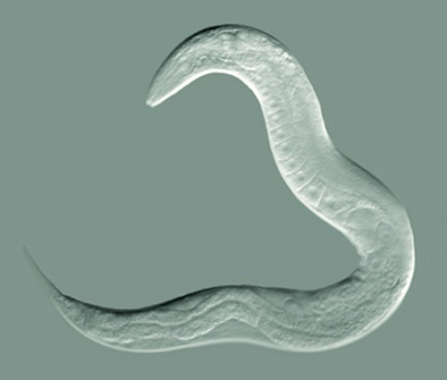

# C.elegans connectome
An attempt to simulate the whole neural circuitry of the roundworm C. elegans and it's 302 neurons. Of course, there is a part of randomness and personal configuration, because of the complexity of the connections (tracing each and every connection), but the overall idea is the same.
This organism's connectome is the most researched and now completely understood by scientists, which makes it an interesting idea for a project of this kind. As a simple creature it has just a few trivial functions that it executes to survive: 
- It moves
- It senses external stimuli like light, food, oxygen, noxious stimuli, pheromones
- It has basic social behaviour

By dividing his connectome in different regions (neural nets) i made my task a lot easier, like so. 

- Motor neurons
- Connector neurons
- Sensory neurons

These neural nets are not isolated, there are 3 neurons that each network has for bridging the communication gap between them. Once the neural circuitry is established, every neuron (except the 3 above) choose it's own axon and get 'assigned' with dendrites automatically among it's network. Now the worm activates part of his circuitry, depending on his actions inside a deterministic and discrete environment (grid system), that includes obstacles, food, other worms, oxygen and poison.

I used files from the OpenWorm project to map each neuron to it's name and corresponding neurotransmitter.

## Research and pictures sources:
Cornelia I. Bargmann, Rockefeller University; WormAtlas; Nature  
https://openworm.org/index.html
