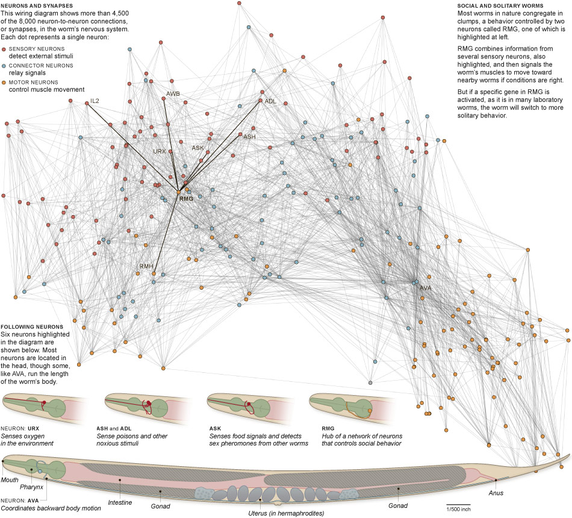

# C.elegans connectome
An attempt to simulate the whole neural circuitry of the roundworm C. elegans and it's 302 neurons. 
His connectome is classified in main three group of neurons as follows:

- Motor neurons
- Connector neurons
- Sensory neurons

For now the whole network have random connections and every neuron choose it's own axon and get 'assigned' with dendrites automatically. The worm then, activates part of his circuitry, depending on his actions inside a deterministic and discrete environment (grid system), that includes obstacles, food, other worms, oxygen and poison.

I used files from the OpenWorm project to map each neuron to it's name and corresponding neurotransmitter.

## Research and pictures sources:
Cornelia I. Bargmann, Rockefeller University; WormAtlas; Nature  
https://openworm.org/index.html
